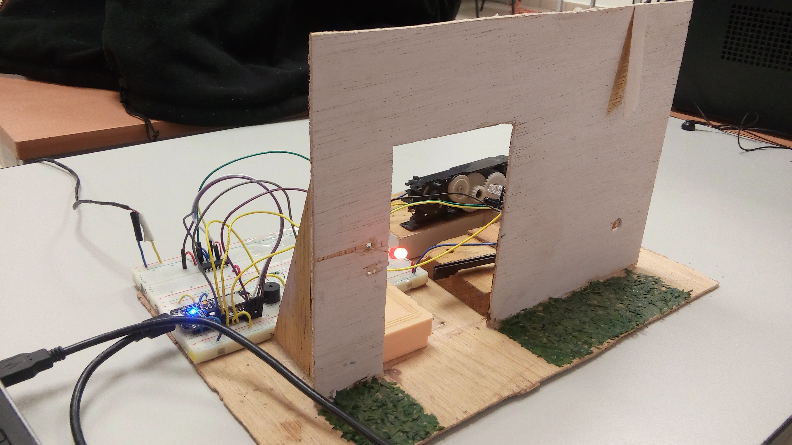
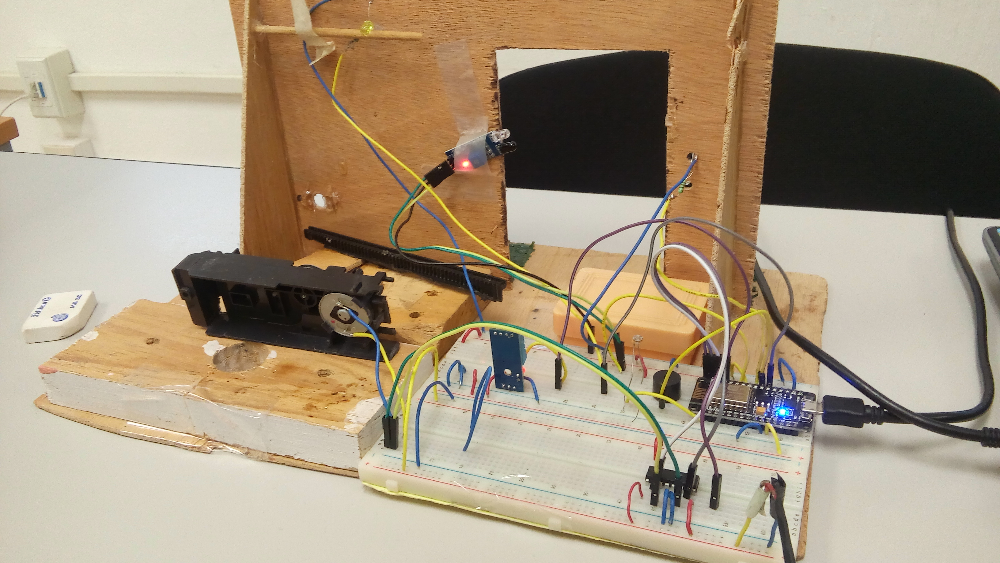
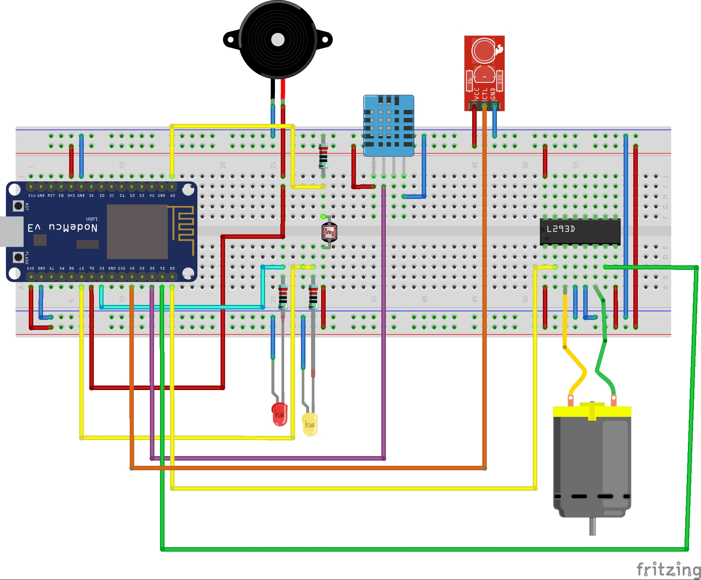
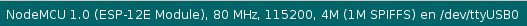
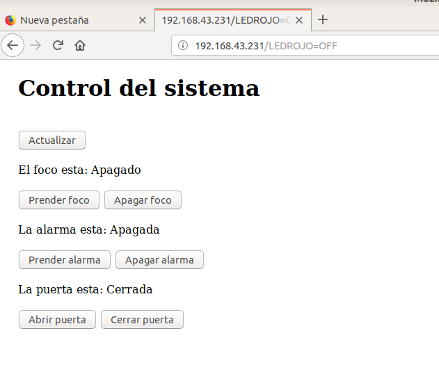
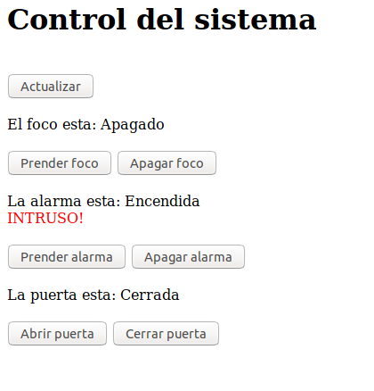
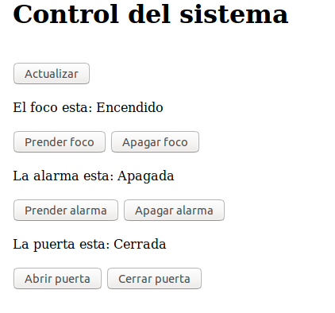
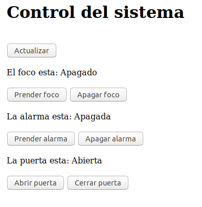
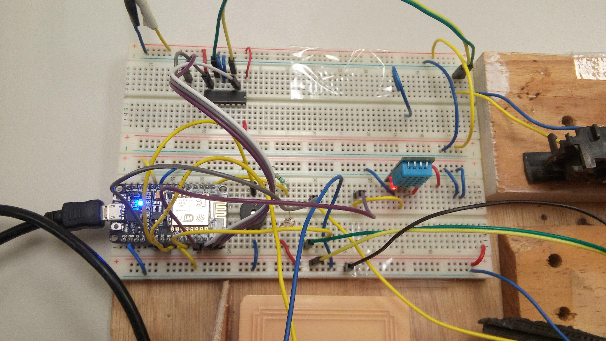

# Sistema domótico en red (WiFi)
Consiste en un sistema de control en red basado en la plataforma Arduino mediante el módulo WiFi nodeMCU ESP8266, con la finalidad de usar un servidor web para interactuar con el sistema domótico.
<div style="display: flex">


</div>

**Especificaciones:**
- Incluye 3 sensores y un motor.
- Se identificaron el puerto 80 del servidor y comunicación serial con el módulo WiFi
- El sistema de control se conectada a una red WiFi alcanzable y en buen estado.
- El servidor muestra estadísticas de los sensores y tomar acciones en consecuencia.

### Pre-requisitos 📋
**Material físico**:
```
-1 protoboard (2 preferentemente para una mejor distribución)
-1 módulo WiFi NodeMCU ESP8266
-Cables macho-macho, macho-hembra
-1 Sensor infrarrojo de movimiento
-1 Sensor DTH11 (temperatura)
-1 Sensor de luminosidad (fotoresistencia)
-1 motor de CD (con reducción de engranaje y barra dentada)
-2 leds (rojo y amarillo)
-1 buzzer
-1 puente-H (L293D)
-3 resistencias de 330 Ohms
```
**Software**:
```
-1 equipo con:
  -Arduino IDE instalado
  -Modelo de la Placa ESP8266 (firmware) instalada en el Arduino IDE
  -Acceso a Internet (preferentemente por Wifi)

-Darle permisos dialout al usuario del equipo para arduino (Linux)
-Driver instalado de la placa para arduino (Otros sistemas operativos)
```
## Introducción
Se conoce como Puerto 80 al que puerto por default, por el medio del cual un servidor HTTP “escucha” la petición hecha por un cliente, es decir por una PC en específico.
<br><br>**NodeMCU ESP8266**
<br>El NodeMCU es el módulo más característico de este tipo. Su precio ronda los 6€. A diferencia de los otros módulos, viene con todo lo necesario para empezar a trabajar de forma autónoma. Incluye un adaptador serie/USB y se alimenta a través del microusb. Está basado en el ESP-12 y la última versión oficial es la 2. Lo más interesante de este módulo es que puedes descargar un firmware que te permite programar en lenguajes como LUA, Python, Basic o JavaScript. Sin duda alguna este módulo es la mejor opción si queremos adentrarnos en el mundo del ESP8266.

## Instalación del sistema (5 pasos) 🔧
## Paso 1. Armar circuito
(Opcional) Crear una maqueta que simule la casa.
Siga el siguiente diagrama de conexión para elaborar la funcionalidad del sistema:



**NOTA**: Si la salida de 5v del nodeMCU no funciona con el circuito L293D, usar una alimentación externa para alimentar el L293D


## Paso 2. Añadir la placa ESP8266 en el Arduino IDE
Para añadir la placa en tu IDE de Arduino necesitas seguir el tutorial (3 pasos) que se encuentra en el siguiente enlace:
https://programarfacil.com/podcast/como-configurar-esp01-wifi-esp8266/

## Paso 3. Seleccionar las especificaciones de la placa
En el menú Herramientas del IDE, elige las espeficiaciones de su placa. En este caso se usó la versión 1.0:
 - a) Placa: NodeMCU 1.0 (ESP-12E Module)    
 - b) Selecciona la velocidad: 115200 Baudios
 - c) Selecciona el puerto USB que conecta el módulo WiFi con el ordenador: /dev/USB0
 
 
 
 ## Paso 4. Cargar el programa
 En el menú Archivo abra el programa y súbalo a su placa.
 NOTA: Asegúrese de tener todo configurado como en el paso anterior.
 
 ## Paso 5. Ejecutar
 Ejecute el programa, abra el monitor serial, póngalo en 115200 Baudios como velocidad y accede en su navegador a la dirección IP que muestra el módulo WiFi.
 Ahora podrá interactuar con el navegador y su casa domótica.
 
 ## Servidor Web
 Esta es la página web la cual contiene botones para el control del sistema domótico. El sistema permitirá apagar o encender la alarma y/o el foco, y abrir o cerrar la puerta ventanilla la cual permitirá el paso a la ventilación.
 
 
 
 Cuando suena la alarma, la página se ve de esta manera: <br><br>
 
 
 Cuando el foco prende, la página se ve de esta manera: <br><br>
 
 
 Finalmente, cuando la puerta o ventanilla de ventilación se abre, se ve de esta manera: <br><br>
 
 
 Todo el control se manipula desde el servidor a los dispositivos de la casa.
 
 ## Resultados 📌
 
 
 
 - Todos los objetivos se han cumplido satisfactoriamente.
 - Se hizo uso de 3 sensores y un actuador (motor reductor con engranajes)
 - El sistema está conectado mediante la red WiFi
 - El servidor uso el protocolo 80 para comunicarse con el cliente mediante la página web
 - La página web puede controlar satisfactoriamente los dispoitivos de la casa domótica, siempre y cuando haya una buena conexión de WiFi
 
 **NOTA:** 
 - Se hizo uso de un botón "Actualizar" para refrescar la página dado una consecuencia de un sensor. Pues no hubo la manera de que se actualizara automáticamente la página.
 - El módulo nodeMCU es tan eficaz que pudo reemplazar la placa arduino sin problemas (solo que tiene menos puertos de salida)


## Construido con 🛠️
Linux: Ubuntu 18.04
* [Ubuntu 18.04](http://releases.ubuntu.com/18.04/) <br />

Arduino IDE
* [Arduino](http://www.arduino.cc/) <br />

Fritzing
* [Fritzing](http://fritzing.org/home/) <br/>

## Probado con 🛠️
La página web ser mostró correctamente en Mozilla Firefox

## Autores ✒️

* **Jorge Enrique Aguado Guaní** - [JorgeGuani](https://github.com/JorgeGuani)
* **Natalia Méndez Martínez** - [Yaxe9512](https://github.com/Yaxe9512)
